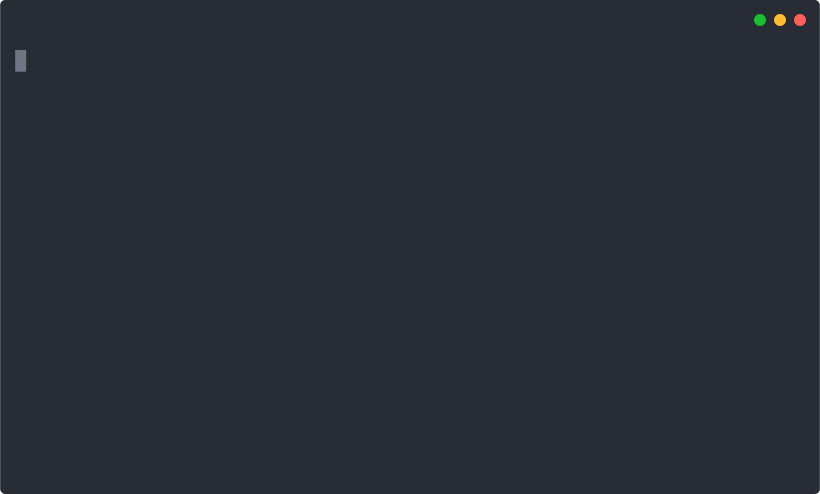
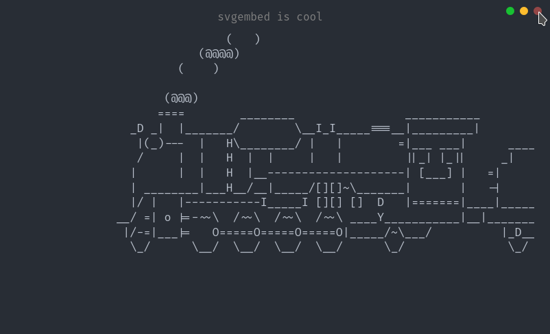

# svgembed

> SVG embedder for <https://github.com/marionebl/svg-term>

## Installing

``` bash
npm install -g git+https://github.com/miraclx/svgembed

# alternatively, with yarn
yarn global add https://github.com/miraclx/svgembed.git
```

## Features

- [x] Window titles
- [x] Embed custom fonts (ttf, otf) **[useful in the case of embedding powerline/nerd fonts]**
- [ ] Multiple font files
- [x] Move icons (close, minimize, maximize) to the right side of the window.
- [x] Window icon darken on hover (doesn't work behind `` tags like on GitHub)
- [ ] Customize window icon order
- [ ] Embed custom CSS
- [ ] Handle filestreams and `stdin`

## Caveats

Since this script just embeds the files you give it along with some SVG patches, the filesize is incremental and can be really large in some cases.
Try using lightweight versions of fonts you embed. Or create custom fonts with the glyphs you need.

Depending on your browser and internet connection, the fonts might take a little while to load.

## Usage

`$ svgembed --help`

``` text
svgembed (c) 2020 Miraculous Owonubi <omiraculous@gmail.com>
------------------------------------------------------------
Usage: svgembed [options]

Options
  -i, --input <VALUE>  the input SVG file
  -o, --output <VALUE> the output file name
  -f, --font <VALUE>   fontfile to be embedded (otf/ttf)
  -t, --title [VALUE]  set terminal window title (default: "Terminal")
  -r, --right          use right-sided window icons
  -v, --hover          dim window icons on hover
  --overwrite          overwrite existing output
  --h, --help          output usage information
```

## Screenshots

### Original SVG from svg-term

`svg-term --in media/demo --out demo.svg --window --term konsole --width 78`

- Input Size: `52.10 KiB`
- Output Size: `501.62 KiB`


### Processed

`svgembed -i demo.svg -o final.svg -r -f nerd_fonts.ttf -t "svgembed is cool" --hover`

- Input Size: `501.62 KiB`
- Font: Fira Code Nerd Font, Regular (`1007.0 KiB`)
- Title: `"svgembed is cool"`
- Icon position: `right`
- On hover: `dim` (view the [raw SVG](https://cdn.jsdelivr.net/gh/miraclx/svgembed/media/final.svg) to see this)
- Output Size: `1844.76 KiB`



### Window icon dim on hover `-v, --hover`



## Library API

### config: \<object\>

- `font`: \<string\>: The font to be embedded, if any.
- `title`: \<string\>: The window title to be used, if any.
- `right`: \<boolean\>: Whether or not to move window icons to right side.
- `hover`: \<boolean\>: Whether or not to dim window icons on hover.

### embedFont

- `file`: \<string\>: string representation of the SVG file.
- `config`: \<[config](#config_object)\>

### insertTitleAndPositionIcons

- `file`: \<string\>: string representation of the SVG file.
- `config`: \<[config](#config_object)\>

## License

[Apache 2.0][license] © **Miraculous Owonubi** ([@miraclx][author-url]) &lt;omiraculous@gmail.com&gt;
